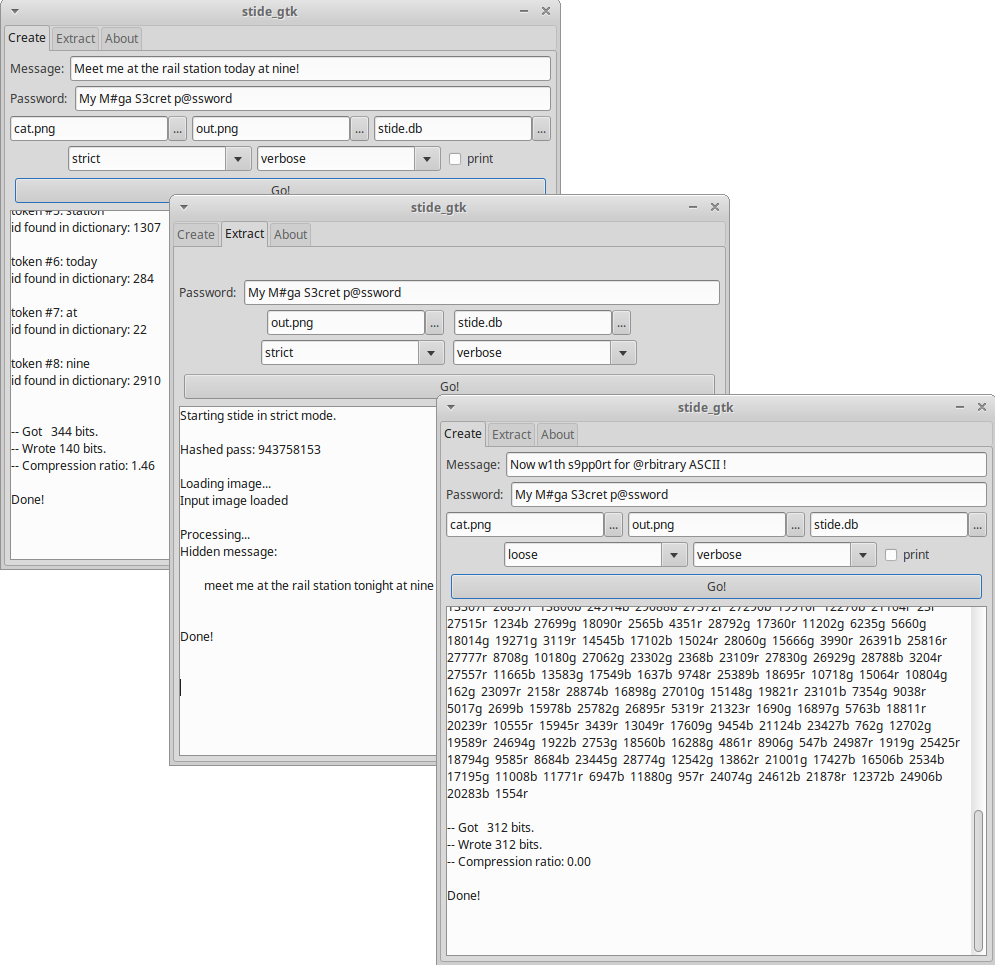

#	STIDE - hiding secrets in images
###	A steganography tool wich features compression, encryption and (almost) non-intrusive hiding techniques.



#### SECURITY NOTES
**Please note that I am neither C guru nor cryptography expert, so use this software at your risk!**

With that being said taking some precations can get you as close as possible to the unbreakable [one-time pad](https://en.wikipedia.org/wiki/One-time_pad) security:
- Follow the usual password guidelines - use a good, long and unique password;
- Only use unique pictures (i.e. made by you);
- Do not ever use something made with gimp or drawings with some software - this results to having very less noise in the picture;
- At best take a picture with your camera;
- Use each picture only once;
- Dispose the original picture immediately;
- The smaller the hidden message the more difficult (if not impossible) is to even detect the noise-looking changes caused by the payload;
- Stide uses only the last single bit in a single color channel in some pixels in a very random looking sequence of color channels and pixels, which leads to theoretically impossible detection - the payload is indistinquishable from random noise. Therefore, detecting or even decyphering the payload should be impossible if the attacker does not have acces to the original picture or the password.

#### MAJOR UPDATE
- Stide is completely rewritten - now portable, fully modular, single binary, lot more options and better responses.
- Now beside the 'strict' mode with words only from the dictionary we added support of 'loose' mode - which accepts arbitrary ASCII characters for input, at the cost of compression.
- Changed license to MIT.
- Name changed because we found some old project on the internet with the same name.
- Build with sqlite3, zlib and libpng as static libs to be even more easy to use - no dependancies.
- Windows support (console only).
- Using the GNU/BSD secure random number generator random();
- Note: the last version is no more backwards compatible.

#### QUICK START:
- this works only on 64 bit linux or 64 bit Windows (32 bit support comes at some point later),
- [get this archive for linux](https://github.com/vlzware/stide/blob/master/releases/stide_3.0_linux_x64.tar.gz?raw=true)
- [get this archive for windows](https://github.com/vlzware/stide/blob/master/releases/stide_3.0_win_x64.zip?raw=true)
- extract the archive and then start ``stide`` over the console/power-schell. Note: on linux you can use the gui: stide_gtk,

- OR for **the latest and greatest** version clone the repository and compile by yourself (see "Compiling").

#### for creating image with embedded secret message:
1. use the **create** tab;
2. set input and output image:
* 	use some jpg, png or bmp image as input (like the included cat.png),
* 	output can be only png or bmp (as of now);
3. set password and type the secret message;
4. set some switches if you need to;
5. and hit **Go!**

#### for extracting the embedded secret message:
1. use the **extract** tab
2. choose the image
3. fill in the password
4. set some switches if you need to;
5. hit **Go!**

### DESCRIPTION:

#### 1. What is Steganography?
[Steganography](https://en.wikipedia.org/wiki/Steganography) - you take something pretty "normal" at first glance 
(like picture), you hide there your message so that (hopefully) no one except the recipient can read it and voila - 
you can communicate in privacy without even looking suspicious.

#### 2. Other software for steganography already exists - why another tool?
- Stide uses different approach, which leads to significantly lower impact on the host image, very difficult detection and ecnrypted message.

#### 3. Compression?
- Stide uses database with the ~10 000 most used english words. Each word has an id in the database. The software stores not the word itself but the id, which leads to heavy compression in almost all cases. Longer sentences lead usually to even more compression.
- The new 'loose' mode do not compress at all - it stores the same size as it reads.

#### 4. Encryption?
- Stide uses stream encryption based on PRNG, which is seeded by the hash of the password. The encryption gets applied to the hiding route, the color channel and on the secret data itself.

#### 5. Compiling on 64 bit systems:
- Note: Compilation on 32 bit systems should be possible too, although you need first to recompile the static libraries of libpng and zlib (also libdl for windows).

- On windows use MinGW with mingw32-pthreads-w32.
- Compile with 'make -f [Makefile]' with the proper Makefile for your platform in the 'src' directory. The resulting binaries - stide (and stide_gtk if on linux) reside in 'bin/[platform]'.
- Stide uses statically builded versions of zlib and libpng.
- sqlite3 source and headers are also compiled.
- Here is the complete output of 'ldd stide':
```
	linux-vdso.so.1 =>  (0x00007ffc7b77e000)
	libm.so.6 => /lib/x86_64-linux-gnu/libm.so.6 (0x00007efffb37e000)
	libc.so.6 => /lib/x86_64-linux-gnu/libc.so.6 (0x00007efffafb3000)
	libpthread.so.0 => /lib/x86_64-linux-gnu/libpthread.so.0 (0x00007efffad96000)
	libdl.so.2 => /lib/x86_64-linux-gnu/libdl.so.2 (0x00007efffab92000)
	/lib64/ld-linux-x86-64.so.2 (0x000055f67faf6000)

```
- 'stide.glade' is a .xml file for the GUI settings;
- 'stide_gtk' is the gtk gui executable - this is basically just an interface to the command line tool.

#### 6. Command line usage:
```
    $./stide
```
- This shows all available options with their description and usage.

* **creating an image:**
```
    $./stide -c[spvdf] [path/to/stide.db] password text img-in [img-out[.png]]
```

* **retrieving secret text:**
```
    $./stide -e[svdf] [path/to/stide.db] password img-in
```

#### 7. Limitations/TODO/planed upgrades?
- The hidden secret is *fragile* - meaning the simplest change to the picture may destroy the payload. Note: this can be also a pro, depending on the situation;
- Outputs only png or bmp;
- ~~No windows binaries~~ or gui (WIP); As of stide_3.0 windows console application available.
- ~~The used png compression is not optimal (WIP) and this can lead to somewhat bigger output
which has nothing to do with the inserted hidden data. Stide adds --nothing-- to the file just changes some bits. In numbers - our example cat.png grows from 66 to 85 kB.~~ Stide switched to libpng, so there is no more png compression penalty on the output.
- ~~words not in the dictionary are not supported~~ Stide now supports both modes - words only from the dictionary ('strict' mode) and 'loose' mode with arbitrary ASCII characters.
	
### CREDITS:
- Stide uses [sqlite3](https://sqlite.org/),

- A static build of [libpng](http://libpng.org/pub/png/libpng.html). The code for saving in png is mostly from [here](http://www.labbookpages.co.uk/software/imgProc/libPNG.html).

- For the needs of libpng, stide compiles also with a static build of [zlib](http://zlib.net/).

- Also using on windows: static build of [libdl](https://github.com/dlfcn-win32/dlfcn-win32).

- Stide uses the stb_image and stb_image_write libraries from: [STB](https://github.com/nothings/stb/).

- For portability stide compiles with the [gnu version](https://www.gnu.org/software/libc/) of random().

- This tool was (originally) made as my final project in [CS50](https://www.edx.org/course/introduction-computer-science-harvardx-cs50x).

- The 10 000 words dictionary is from [Josh Kaufman](https://github.com/first20hours/google-10000-english) (I added small number of words at the end like my name and stide_eof) Data files are derived from the Google Web Trillion Word Corpus, as described by Thorsten Brants and Alex Franz, and distributed by the Linguistic Data Consortium. Subsets of this corpus distributed by Peter Novig. Corpus editing and cleanup by Josh Kaufman.

- the sample picture 'cat.png' was taken from http://www.freeimages.com

DISCLAIMER:
 Use this software at your own risk.


last updated: 21.01.2018
