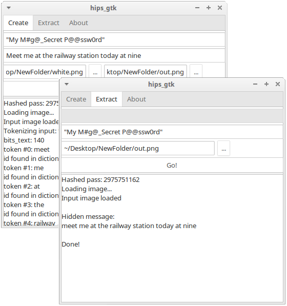

#	STIDE - hiding secrets in images
###	A steganography tool wich features compression, encryption and (almost) non-intrusive hiding techniques.



#### MAJOR UPDATE
- The code is completely rewritten - now fully modular, single binary, lot more options and better responses.
- Now beside the 'strict' mode with words only from the dictionary we added support of 'loose' mode - which accepts arbitrary ASCII characters for input, at the cost of compression.
- Fully backwards compatible (use the '-s' switch for 'strict' mode).
- The old binaries and GUI can be found in bin/linux/old
- Changed license to MIT.
- Name changed because we found some old project on the internet with the same name.
- More info, updated GUI and Windows binaries coming soon!

#### QUICK START:
- this works only on linux (Windows support comes at some point later),
- [get this archive](https://github.com/vlzware/HIPS-steganography-tool/blob/master/releases/hips_bin_1.0.0.tar.gz)
- extract the archive and then start hips_gtk,
- OR for the **latest and much better command line version** clone the repository and compile by yourself with `make` - the resulting binary is bin/linux/stide
#### for creating image with embedded secret message:
1. use the **create** tab
2. set input and output image:
* 	use some jpg, png or bmp image as input (like the included cat.png),
* 	output can be only png or bmp (as of now).
3. set password and type the secret message
4. and hit **Go!**

#### for extracting the embedded secret message:
1. use the **extract** tab
2. choose the image
3. fill in the password
4. hit **Go!**

#### SECURITY NOTE:
- Only use unique pictures (i.e. made by you) and use each picture just once with the same password - this adds a lot to the overall security

### DESCRIPTION:

#### 1. What is Steganography?
[Steganography](https://en.wikipedia.org/wiki/Steganography) - you take something pretty "normal" at first glance 
(like picture), you hide there your message so that (hopefully) no one except the recipient can read it and voila - 
you can communicate in privacy without even looking suspicious.

#### 2. Other software for steganography already exists - why another tool?
- Stide uses different approach, which leads to significantly lower impact on the host image, very difficult detection and ecnrypted message.

#### 3. Compression?
- Stide uses database with the ~10 000 most used english words. Each word has an id in the database. The software stores not the word itself but the id, which leads to heavy compression in almost all cases. Longer sentences lead usually to even more compression.
- The new 'loose' mode do not compress at all - it stores the same size as it reads.

#### 4. Encryption?
- Stide uses stream encryption based on PRNG, which is seeded by the hash of the password. The encryption gets applied to the hiding route, the color channel and on the secret data itself.

#### 5. More details/ example?
* Usage:
```
    $./stide
```
- This shows all available options with their description.

* **creating an image:**
```
    $./stide -c[spvdf] [path/to/stide.db] password text img-in [img-out[.png]]
```

* **retrieving secret text:**
```
    $./stide -e[svdf] [path/to/stide.db] password img-in
```

#### 6. Limitations/TODO/planed upgrades?
* no windows binaries or gui, although you can compile and run all under cygwin
* outputs only png or bmp
* the used png compression is not optimal (WIP) and this can lead to somewhat bigger output
which has nothing to do with the inserted hidden data. Stide adds --nothing-- to the file just changes some bits.
In numbers - our example cat.png grows from 66 to 85 kB.
* ~~words not in the dictionary are not supported~~ Use the last command line version 'stide' which supports both - words only from the dictionary ('strict' mode) and 'loose' mode with arbitrary ASCII characters.
	
### CREDITS:

* HIPS uses the stb_image and stb_image_write libraries from: [STB](https://github.com/nothings/stb/).

* This tool was (originally) made as my final project in [CS50](https://www.edx.org/course/introduction-computer-science-harvardx-cs50x).

* The 10 000 words dictionary is from [Josh Kaufman](https://github.com/first20hours/google-10000-english) (I added small number of words at the end like my name and hips_eof) Data files are derived from the Google Web Trillion Word Corpus, as described by Thorsten Brants and Alex Franz, and distributed by the Linguistic Data Consortium. Subsets of this corpus distributed by Peter Novig. Corpus editing and cleanup by Josh Kaufman.

* the sample picture 'cat.png' was taken from http://www.freeimages.com

DISCLAIMER:
 Use this software at your own risk.


last updated: 06.01.2018
